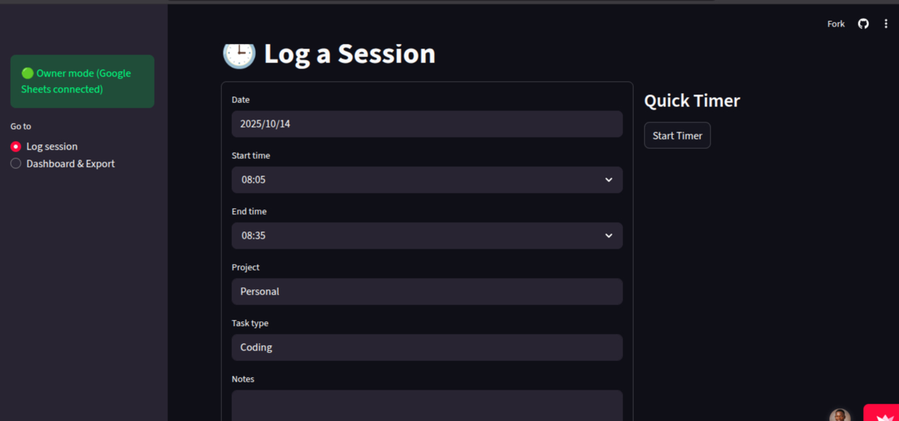

# 🕒 MVP Time Tracker

[](https://mvp-time-tracker.streamlit.app)
[](https://www.python.org/)
[](LICENSE)

**MVP Time Tracker** is a simple yet evolving productivity app designed to help you log, analyze, and later *learn* from your daily work sessions.

It’s built in three progressive stages:

1. ✅ **Stage 1 – Time Tracking (Current Phase)**  
   Log your daily sessions manually or use the quick timer to track hours spent on different projects and tasks.

2. 🔄 **Stage 2 – Smart Tagging (Upcoming)**  
   Use NLP models to automatically tag your sessions based on notes or descriptions.

3. 🤖 **Stage 3 – AI Productivity Coach (Future)**  
   Personal AI assistant that analyzes your patterns, highlights trends, and gives productivity insights.

---

## 🚀 Features

- ⏱️ **Manual & Quick Logging:** Log sessions manually or start/stop the timer for real-time tracking.  
- 📊 **Dashboard View:** Visualize your total hours, project breakdowns, and task summaries.  
- 📤 **Export to CSV:** Download your session logs for offline use or analysis.  
- ☁️ **Google Sheets Sync:** Automatically backs up session data to Google Sheets.  
- 🌓 **Modern UI:** Clean dark-themed Streamlit interface with simple navigation.

---

## 🧩 Tech Stack

- **Framework:** Streamlit  
- **Data Handling:** Pandas  
- **Visualization:** Matplotlib  
- **Integration:** Google Sheets API (via `gspread`, `google-auth`, `google-auth-oauthlib`, `google-auth-httplib2`)

---

## 🖼️ App Preview



> Screenshot of the “Log a Session” view showing manual logging and quick timer options.

---

## ⚙️ Installation & Usage

### 1. Clone the repository
```bash
git clone https://github.com/your-username/mvp-time-tracker.git
cd mvp-time-tracker
```   

### 2. Install dependencies
```bash
pip install -r requirements.txt
```   

### 3. Set up Google Sheets API credentials

1. Create a project on **Google Cloud Console**.  
2. Enable **Google Sheets API** and **Google Drive API**.  
3. Download your credentials JSON file.  
4. Save it as `credentials.json` in the project root.

### 4. Run the app
```bash
streamlit run app.py
```   

### 5. Access the app

Open the link provided in your terminal, or visit:  
👉 [http://localhost:8501](http://localhost:8501)

---

## 📈 Roadmap

| Phase | Goal                                  | Status         |
| ----- | ------------------------------------- | -------------- |
| 1     | Basic time tracking and dashboard     | ✅ Completed    |
| 2     | NLP-based automatic session tagging   | 🔄 In progress |
| 3     | AI productivity insights and coaching | ⏳ Planned      |

---

## 🔮 Future Plans

- Add daily/weekly summaries by project and task type  
- Introduce authentication for multiple users  
- Deploy analytics dashboard with interactive filters  
- Train custom NLP models for automatic activity tagging  
- Build AI assistant for personalized productivity feedback  

---

## 🪪 License

This project is licensed under the **MIT License** feel free to use, modify, and share with attribution.

---

## 👨🏽‍💻 Author

**Caleb Udeibom**  
*Machine Learning Engineer*

